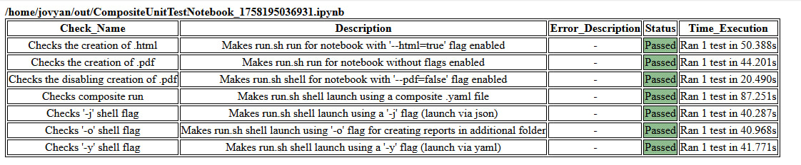

# Env Checker – Tests Guide

This guide explains how to run and use the current tests and what is expected from notebooks executed by the `run.sh`
orchestrator.

## Layout

```text
jovyan/tests/
  ├─ unittests/
  │   ├─ reports/          # HTML/PDF related tests
  │   ├─ shells/           # run.sh flags and composite execution
  │   └─ integrations/     # reserved for future integration tests (currently not used)
  ├─ test_utils/           # helpers used by tests
  ├─ CompositeUnitTestNotebook.ipynb  # composite notebook runner for unit tests
  └─ composite_test.yaml   # yaml example for composite run
```

Notes:
- There is one minimal example notebook in `/home/jovyan/tests/notebooks/` that can be used as a template for
creating your own cases (parameters + result cell).
- Integration tests are not active yet; unit tests are the focus now.

## How to run

### 1) Run via composite YAML

Example command to execute a bulk run described in YAML:

```bash
bash run.sh tests/composite_test.yaml
```

As a result, two sample notebooks will be executed: one that runs all unit tests, and a second minimal test notebook
used by the unit tests. This setup is provided solely to demonstrate how bulk runs work.

### 2) Run the composite test notebook

`CompositeUnitTestNotebook.ipynb` orchestrates Python test scripts located under `jovyan/tests/unittests/**`. It runs
unit checks and produces:
- a JSON report saved under `/home/jovyan/out/tests/<name>.json`,
- scrapbook data used by HTML aggregation.

Folders meaning:
- `unittests/reports/`: checks around report generation (HTML/PDF and related flags).
- `unittests/shells/`: checks for `run.sh` flags (`-o`, `-j`, `-y`) and composite execution.
- `unittests/integrations/`: placeholder for future integration checks (not active yet).

Result interpretation in the notebook:
- Each unit check contributes a status (Passed/Failed) and timing to the final table.
- The final boolean cell indicates overall success. If it is `True`, all checks passed; otherwise at least one failed.

Run the composite test notebook with HTML generation:

```bash
bash run.sh --html=true tests/CompositeUnitTestNotebook.ipynb
```

Results:
- An HTML table summarizing all tests and their statuses will be generated (per-report aggregation over executed
notebooks).
- For each executed case you can inspect the produced `.ipynb` and, if PDF reporting is enabled (default), a `.pdf`
under `/home/jovyan/out/`.

Example HTML summary (from a composite run):



## Tips

- To generate HTML summary, run with `--html=true`.
- To disable PDF generation, pass `--pdf=false`.
- To place outputs under a subfolder: `-o <subdir>`.
